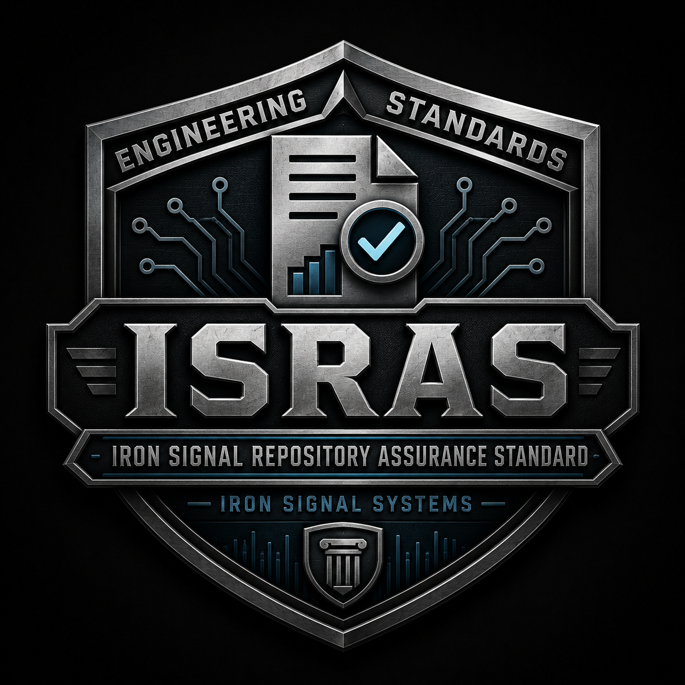

# Iron Signal Repository Assurance Standard

> **Built on purpose. Backed by discipline. Engineered to endure.**

<p align="center">
  
</p>


## Repository identity

**ISRAS is the governing engineering authority for Iron Signal Systems repositories.** It establishes consistent requirements, decision rationale, validation methods, evidence expectations, release boundaries, and lifecycle controls across company projects. Public use is permitted, but external adoption is not its primary design objective.

This repository is publicly visible to support transparency, review, and reuse
where appropriate. Public visibility does not redefine ISRAS as a general-purpose
public product.

The authoritative scope is defined in
[`standards/REPOSITORY-IDENTITY-AND-PUBLIC-USE.md`](standards/REPOSITORY-IDENTITY-AND-PUBLIC-USE.md)
and [`standards/ISRAS-VISION.md`](standards/ISRAS-VISION.md).

## ISRAS vision

**ISRAS** stands for the **Iron Signal Repository Assurance Standard**. It is
an organization-wide Iron Signal Systems standard governing repository
reproducibility, validation, historical verification, change control, evidence,
acceptance, release, deployment verification, recovery, long-term
maintainability, engineering-standard inheritance, phase compliance, and
bounded authority.

ISRAS does **not** stand for “Information System Risk Assessment” and is not
itself a risk-assessment methodology. Projects may be required to maintain
information-system risk assessments, threat models, risk registers, findings,
and remediation evidence, but those remain separate assurance artifacts. ISRAS
governs how those artifacts and their related implementation and evidence are
versioned, validated, accepted, and maintained.

## Current implementation profile

Project-command execution for Go-profile consumers preserves the active selected
Go toolchain directory while retaining an otherwise bounded `PATH`. The consuming
project's `go.mod` `go` directive is enforced as a minimum: later compatible Go
releases, including valid custom-suffix toolchains, are accepted. Governed
project-command evidence schema version 2 records the exact selected Go identity,
fixed local/off environment, project minimum, optional toolchain directive, and
minimum-satisfaction result. Multi-module consumers receive a deterministic
per-module source inventory, and the selected Go implementation must satisfy
every discovered source module before command execution. Generated `.local/`
runtime evidence is explicitly excluded from the module boundary.

This source boundary declares `0.1.4`. Before publication it is a release
candidate; after publication only the exact signed `isras-v0.1.4` tag and its
verified six-asset GitHub Release can establish accepted release identity. A
stable `VERSION` value, `dev`, or `main` alone is never adoption or publication
authority.

ISRAS `0.1.4` carries forward the hosted SSH trust and evidence-retention repairs
prepared for `0.1.3` and corrects the publication defects discovered during the
first real `0.1.3` publication attempt. Release discovery now includes drafts,
asset upload uses the authenticated no-clobber GitHub CLI release uploader, and
failed-draft cleanup is verified by exact release ID.

The published `0.1.2` release remains immutable. The signed `isras-v0.1.3` tag is
also immutable, but it was not published after its uploader targeted the invalid
derived host `api.uploads.github.com` and its cleanup path incorrectly reported
success while an empty draft remained. That exact draft was independently
verified and deleted. `0.1.3` is not published, accepted, or adoption authority.

This `0.1.4` source candidate is not consuming-project adoption authority until it
passes the complete acceptance, release, artifact, tag, publication, and
post-publication hosted-consumer gates.

This repository implements the **ISRAS Solo Developer Baseline** as a practical
baseline for a single developer while retaining truthful engineering discipline
and a path toward the complete ISRAS vision.

The profile requires:

- signed commits and signed release tags;
- committed, reviewable test and validation source;
- exact commit identification;
- clear self-validation status without false independent-review claims;
- Go formatting, static analysis, tests, builds, module checks, and known
  vulnerability scanning;
- local secret detection before source is committed or pushed;
- automatic censoring of possible sensitive values in terminal output and logs;
- bounded redaction and allowlist workflows;
- a local `*.log` for every failed check;
- concise terminal dashboards with exact safe commands for the detected issue;
- evidence-qualified support for Arch Linux, selected supported Ubuntu Server
  LTS release lines, and selected supported Fedora Server release lines unless a
  project declares a different scope.

### Platform validation evidence

The active baseline continuously validates Ubuntu Server 22.04 LTS and 24.04
LTS on native GitHub-hosted virtual machines. Arch Linux and Fedora Server 43
and 44 are continuously validated in their official OCI userlands on a
GitHub-hosted Linux runner.

Container-userland evidence validates distribution packages, tools, shell,
filesystem, and linked-userland behavior used by ISRAS. It does not establish
native kernel, boot, systemd, SELinux-enforcement, firewall, hardware,
deployment, recovery, or complete operational compatibility. The exact evidence
classes and lifecycle rules are defined in
[`standards/PLATFORM-SUPPORT.md`](standards/PLATFORM-SUPPORT.md).

The earlier ISRAS v1, v2, and v3 development work is preserved through the
archive branch, signed archive tag, and local Git bundle created by the restart
installer. That work remains available as a future source for team, production,
regulated, and independently reviewed profiles.

## Core standard and project framework

ISRAS defines required engineering outcomes, assurance evidence, lifecycle
controls, and repository governance. It does not prescribe one programming
language, application architecture, framework, or deployment model for every
project.

Go is the initial implementation language for ISRAS tooling and the first
supported project profile. Projects retain authority to select another justified
technology under an accepted profile.

Each adopting project pins one accepted ISRAS release and remains governed by
that exact release until an explicit upgrade. The validator and framework remain
versioned Engineering Standards release artifacts rather than copied product
source.

See:

- [`standards/ISRAS-CORE-AND-LANGUAGE-PROFILES.md`](standards/ISRAS-CORE-AND-LANGUAGE-PROFILES.md)
- [`standards/GO-REFERENCE-PROFILE.md`](standards/GO-REFERENCE-PROFILE.md)
- [`standards/HOSTED-SSH-SIGNER-TRUST.md`](standards/HOSTED-SSH-SIGNER-TRUST.md)
- [`standards/PINNED-PROJECT-FRAMEWORK.md`](standards/PINNED-PROJECT-FRAMEWORK.md)
- [`standards/PROJECT-PIN-SCHEMA.md`](standards/PROJECT-PIN-SCHEMA.md)
- [`standards/PROJECT-INITIALIZATION-AND-ADOPTION.md`](standards/PROJECT-INITIALIZATION-AND-ADOPTION.md)
- [`standards/ISRAS-RELEASE-ARTIFACT-CONTRACT.md`](standards/ISRAS-RELEASE-ARTIFACT-CONTRACT.md)
- [`standards/RELEASE-ARTIFACT-PRODUCTION.md`](standards/RELEASE-ARTIFACT-PRODUCTION.md)
- [`standards/RELEASE-PUBLICATION.md`](standards/RELEASE-PUBLICATION.md)
- [`standards/ARTIFACT-ACQUISITION-AND-VERIFICATION.md`](standards/ARTIFACT-ACQUISITION-AND-VERIFICATION.md)
- [`standards/EXTERNAL-TARGET-ROOT.md`](standards/EXTERNAL-TARGET-ROOT.md)
- [`standards/PROJECT-COMMAND-EXECUTION.md`](standards/PROJECT-COMMAND-EXECUTION.md)
- [`standards/PROJECT-UPGRADE-CONTRACT.md`](standards/PROJECT-UPGRADE-CONTRACT.md)

## Quick start

Build the repository-owned validator:

```bash
./tools/build-validator.sh
```

Run complete development validation:

```bash
./.local/bin/isras-validate all
```

Run commit validation after committing the exact candidate:

```bash
./.local/bin/isras-validate all --mode commit
```

Validate an explicitly selected repository without changing the caller's working
directory:

```bash
./.local/bin/isras-validate \
  --repo /src/example-project \
  project-pin validate
```

After `isras-v0.1.4` is accepted and published, its linker-bound validator can
initialize a clean Iron Signal Systems Go repository from the exact verified
release without committing or pushing:

```bash
isras-validator-linux-amd64 \
  --repo /src/example-project \
  project-pin initialize \
  --release isras-v0.1.4 \
  --go-defaults
```

The initializer refuses `isras-v0.1.1` because that immutable release framework
does not contain the reusable hosted workflow required by its own project pin.
The running executable must itself be the exact linker-bound validator artifact
from the requested release. Runtime evidence is fixed to untracked
`.local/isras`; arbitrary evidence exclusions are not accepted.

A linker-bound release validator also reports `version` and `help` outside any
Git repository. After its release identity, target origin, and committed pin all
match, it may run one exact project-owned validation command:

```bash
isras-validator-linux-amd64 \
  --repo /src/example-project \
  project-command run test
```

Command execution uses no implicit shell, inherits only a bounded environment,
and retains private redacted evidence below the pin's evidence directory.

Build and run clean-clone release validation after the exact signed commit has
been pushed to its remote branch:

```bash
./tools/build-release-validator.sh
./.local/bin/isras-release-validate
```

Build the staged repository-owned release workflow command:

```bash
./tools/build-release-command.sh
```

Run its two deliberately separated source and tag stages:

```bash
./.local/bin/isras-release check
./.local/bin/isras-release tag --confirm
```

The `check` stage changes no Git refs. The `tag` stage creates only the signed
local tag. The legacy `isras-release publish` entry point is disabled so release
assets cannot bypass the controlled publication verifier.

Build the local release-artifact producer:

```bash
./tools/build-release-artifacts.sh
```

The producer requires a stable signed release commit and signed annotated tag.
It creates validator, framework, contracts, provenance, and checksum-manifest
bytes under `.local/releases/` without publishing them. See
[`standards/RELEASE-ARTIFACT-PRODUCTION.md`](standards/RELEASE-ARTIFACT-PRODUCTION.md)
for the explicit provenance inputs and production command.

Build and run the separately named publication preflight after the exact tag has
been pushed and the deterministic artifacts have been reviewed:

```bash
./tools/build-release-publication.sh
./.local/bin/isras-release-publication check --version 0.1.4
```

Only an explicitly reviewed `publish --confirm` invocation may create the draft,
upload the six assets, re-download and verify the remote bytes, and publish the
release. The publication command never creates or pushes a tag and never moves
`main`. See
[`standards/RELEASE-PUBLICATION.md`](standards/RELEASE-PUBLICATION.md).

Run only the secret scanner:

```bash
./.local/bin/isras-validate secrets
```

The validator prints only the commands relevant to a detected problem. Commands
are labeled as read-only, networked, proposal-creating, or working-tree
modifying actions.

## Assurance status

This repository provides a **self-validated** engineering baseline. A successful
validation run does not establish independent review, certification, regulatory
compliance, production readiness for every adopting project, or absence of all
vulnerabilities.

See:

- [`standards/ISRAS-VISION.md`](standards/ISRAS-VISION.md)
- [`standards/SOLO-DEVELOPER-BASELINE.md`](standards/SOLO-DEVELOPER-BASELINE.md)
- [`standards/TESTING-AND-VALIDATION.md`](standards/TESTING-AND-VALIDATION.md)
- [`standards/FAILURE-LOGGING-AND-REMEDIATION.md`](standards/FAILURE-LOGGING-AND-REMEDIATION.md)
- [`standards/PLATFORM-SUPPORT.md`](standards/PLATFORM-SUPPORT.md)
- [`standards/RELEASES-AND-SIGNING.md`](standards/RELEASES-AND-SIGNING.md)
- [`standards/CLEAN-CLONE-RELEASE-VALIDATION.md`](standards/CLEAN-CLONE-RELEASE-VALIDATION.md)
- [`standards/RELEASE-WORKFLOW-AUTOMATION.md`](standards/RELEASE-WORKFLOW-AUTOMATION.md)
- [`standards/RELEASE-PUBLICATION.md`](standards/RELEASE-PUBLICATION.md)
- [`docs/archive/README.md`](docs/archive/README.md)

### Go vulnerability validation boundary

For Go-profile repositories, `known_vulnerabilities` is a mandatory specialized operation. ISRAS verifies the exact pinned scanner, executes every governed module with the selected local Go toolchain, parses streaming evidence, and records typed JSON and text output. Reachable or unknown findings fail until the governed exception model is implemented and accepted.

### Governed vulnerability exceptions

A reachable Go vulnerability is not ignored or hidden. It may pass only through
an exact, independently approved, time-bounded exception at
`.isras/govulncheck-exceptions.json`. ISRAS retains the original finding and
records whether each exception was used, unused, or mismatched. Unknown findings,
unexcepted reachable findings, stale records, and unused exception declarations
fail closed.

### Documentation-impact gate

ISRAS rejects implementation, schema, workflow, release, or adoption changes
whose required standards, records, examples, and changelog updates are absent
from the same reviewed commit range. Run:

```text
isras-validate documentation-impact --base COMMIT --head COMMIT
```

The command uses exact commit IDs, evaluates merge-base-to-head changes, and
retains deterministic JSON and text evidence under
`.local/validation/documentation-impact/`.
